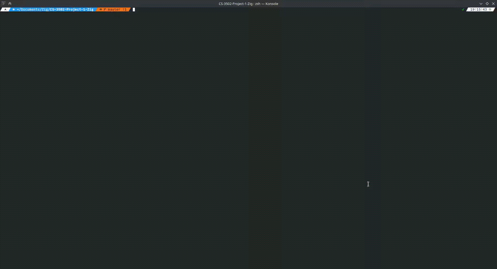
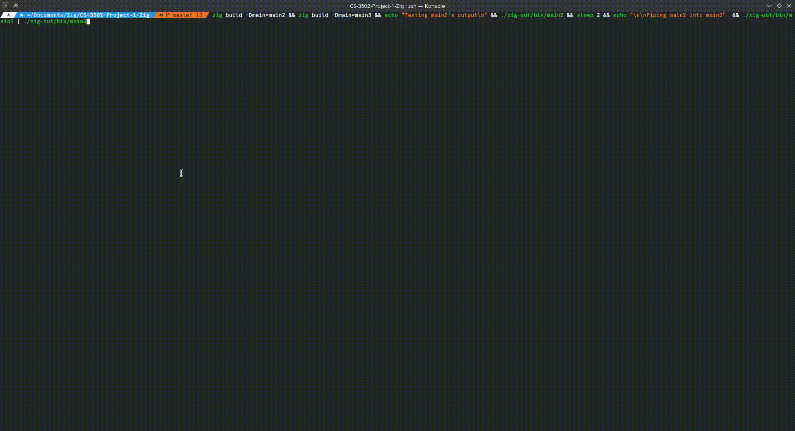

# CS-3502-Project-1-Zig
## Installation
Install [Zig](https://github.com/ziglang/zig/wiki/Install-Zig-from-a-Package-Manager) 
and [Git](https://git-scm.com/downloads) 
`git clone https://github.com/bearofbusiness/CS-3502-Project-1-Zig.git && cd CS-3502-Project-1-Zig`
## Multi-Threading & Mutex Implementation
### Run
`zig build run`
### Output

## IPC
### Run
`zig build -Dmain=main2 && zig build -Dmain=main3 && echo "Testing main2's output\n" && ./zig-out/bin/main2 && sleep 2 && echo "\n\nPiping main2 into main3"  && ./zig-out/bin/main2 | ./zig-out/bin/main3`
### Output

